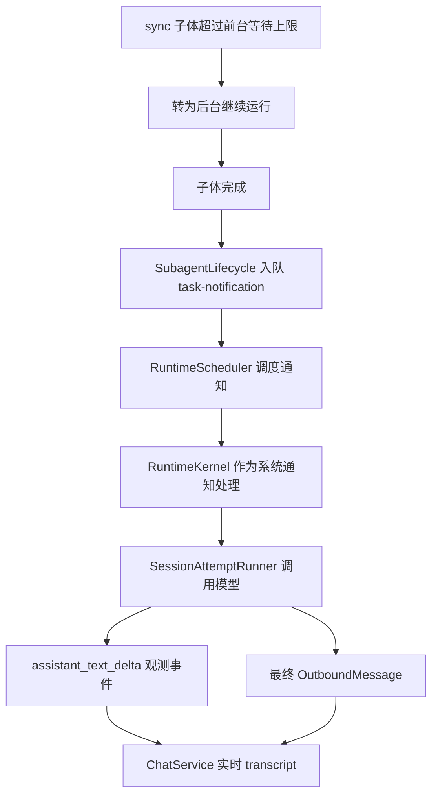
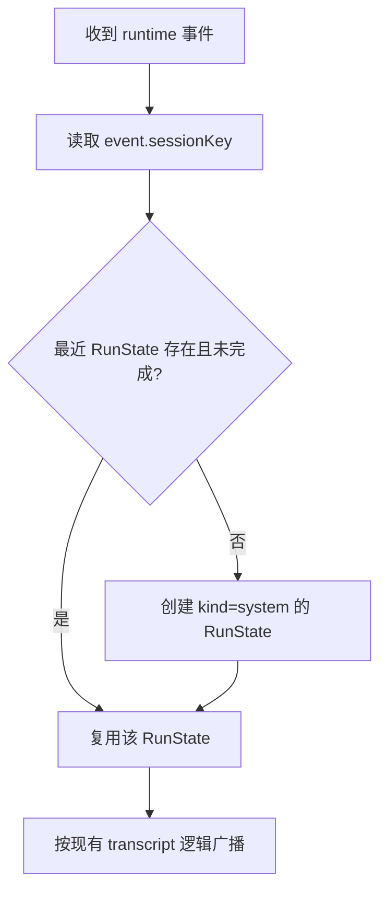

# 后台系统运行流式显示问题分析与修复方案

## 一、问题现象

同步模式子智能体超过前台等待上限后，会转为后台继续执行。后台任务完成后，主智能体能收到 `task-notification` 并生成后续回复，WebUI 也能显示最终内容。

当前异常是：后续内容不是流式显示，而是在模型完整生成结束后一次性显示。

同类问题不只存在于 `task-notification`。凡是不经过 `ChatService.send()` 创建前端运行态的系统触发运行，例如后台任务通知、cron、heartbeat，都没有天然的 WebUI `RunState`，因此都可能无法流式显示。

## 二、相关链路



普通用户消息的流式显示依赖 `assistant_text_delta` 事件；最终 `OutboundMessage` 主要用于结束运行和非流式兜底。

## 三、根因

### 3.1 系统触发运行没有前端运行态

WebUI 用户消息通过 `ChatService.send()` 创建 `RunState`。但 `task-notification`、cron、heartbeat 等系统触发运行走的是 `RuntimeCommandQueue -> RuntimeKernel.execute_command -> _process_message`，不经过 `ChatService.send()`，因此不会创建新的 `RunState`。

### 3.2 流式事件靠 sessionKey + 最近 run 归属

当前 observability 的 `assistant_text_delta` 事件不携带 `run_id`。`ChatService` 只能通过事件里的 `sessionKey` 查找该会话最近的 `RunState`。

这意味着真正决定流式事件能否显示的条件是：事件到达时，该 `sessionKey` 下必须存在一个 `done=False` 的运行态。

### 3.3 已完成旧 run 会过滤 delta

sync 子体转后台时，前台那次用户运行已经返回“转为后台继续执行”，并收到 `transcript.done`。因此该会话最近的 `RunState` 已经是 `done=True`。

后台通知回来后，`assistant_text_delta` 仍按同一个 sessionKey 到达，但 `ChatService._handle_assistant_event()` 会因为最近 run 已完成而丢弃事件。

### 3.4 最终内容通过 outbound 兜底显示

模型完整生成后，`RuntimeKernel` 返回最终 `OutboundMessage`。现有 `task-notification` 分支会强制补一个完整文本块，所以最终内容可以显示。

但这个路径只拿到完整文本，不包含增量事件，因此表现为一次性显示。

### 3.5 会话键必须全链路一致

流式成立要求三处 key 一致：

- delta 事件的 `sessionKey`，来自 runner 的 `thread_id`，也就是 `command.session_key`。
- 最终 outbound 的 `chat_id`，由 `RuntimeKernel._derive_channel_and_chat_id()` 推导。
- 前端 SSE 订阅使用的 `sessionKey`。

如果任一环节出现 `webui:s1` 与 `s1`、或 `webui:webui:s1` 与 `webui:s1` 的错位，delta、done、历史持久化就会落到不同会话。

## 四、推荐方案：惰性创建系统 RunState

### 4.1 核心思路

不要求 observability 事件贯穿 `run_id`。保持当前 sessionKey 归属模型，在 WebUI 侧为系统触发运行惰性创建一个新的系统 `RunState`。

当 `ChatService` 处理运行时事件时，如果该 session 下没有可用运行态，或最近运行态已经完成，则创建一个新的系统运行态：

- `done=False`
- `kind="system"`
- `session_key=event.sessionKey`
- `run_id` 可由本地生成，用于前端事件序列和 done 收尾

之后该 session 的 `assistant_text_delta`、`assistant_text`、tool、image、compaction 事件都归属到这个系统运行态。

### 4.2 触发时机

在已订阅的事件处理入口中惰性触发，不新增 orchestrator 订阅。

建议覆盖：

- `_handle_assistant_event()`
- `_handle_tool_event()`
- `_handle_image_event()`
- `_handle_compaction_event()`

处理规则：



### 4.3 收尾规则

系统运行的结束仍由最终 `OutboundMessage` 驱动。

`ChatService.on_outbound()` 收到系统触发运行的 outbound 时：

- 如果该系统 run 已经通过 delta 产生文本块，只发送 `transcript.done`。
- 如果没有任何 delta，例如 provider 不产生流式增量，则补一个完整 `assistant_text` 块，再发送 `transcript.done`。

这保留真实流式体验，同时兼容非流式响应。

### 4.4 会话键规则

通知入队和 outbound 推导必须保持同一 WebUI session key。

规则：

- 如果 `origin_chat_id` 已经是 `webui:xxx`，直接作为 `session_key`。
- 如果 `origin_chat_id` 是裸 id，再拼接为 `webui:xxx`。
- `payload.chat_id` 保持与前端订阅键一致，避免 final outbound 发到裸 id。

## 五、RunState 结构调整

建议给 `RunState` 增加一个来源字段：

```text
kind: "user" | "system"
```

用途：

- 区分用户发送产生的运行和系统触发运行。
- 前端可避免把系统 run 当作输入框发送态。
- 后续可按来源展示不同状态文案。

当前最小修复中，前端可以不立即改变 UI，只要后端的 SSE 事件保持原协议即可；`kind` 可先作为后端内部字段。

## 六、为什么不推荐 run_id 贯穿作为当前修复

让 observability 事件统一携带 `run_id` 是更精确的长期方案，但当前成本更高：

- `SessionAttemptRunner`、`RunOrchestrator`、`RuntimeKernel`、observability emit 调用都需要传递 run_id。
- 需要处理重试、恢复、后台通知、cron、heartbeat 等多入口一致性。
- 现有前端和后端归属逻辑主要基于 sessionKey，需要较大改造。

因此它适合作为后续演进，不作为当前问题的最小修复路径。

## 七、风险与约束

- 同一会话若用户消息和系统通知同时运行，最近 run 启发式仍存在归属风险。当前调度器串行执行命令，可降低实际并发风险。
- 必须保证系统 run 的 done 由最终 outbound 触发，否则前端可能持续显示运行中。
- 若系统 run 没有任何 delta，最终 outbound 必须补完整文本块，否则用户看不到结果。
- 会话键错位会直接导致流式、done、历史落入不同会话，需要测试覆盖。

## 八、验证重点

建议测试覆盖：

- `task-notification` 在旧用户 run 已完成后，收到 `assistant_text_delta` 时会创建系统 run 并流式广播。
- 系统 run 已有流式文本时，最终 outbound 只发 done，不重复补全文。
- 系统 run 没有流式文本时，最终 outbound 补完整 assistant 文本并发 done。
- `webui:s1` 形式的会话键不会被拼成 `webui:webui:s1`。
- delta 事件、outbound、前端订阅使用同一个 sessionKey。
