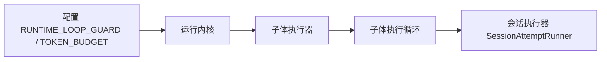
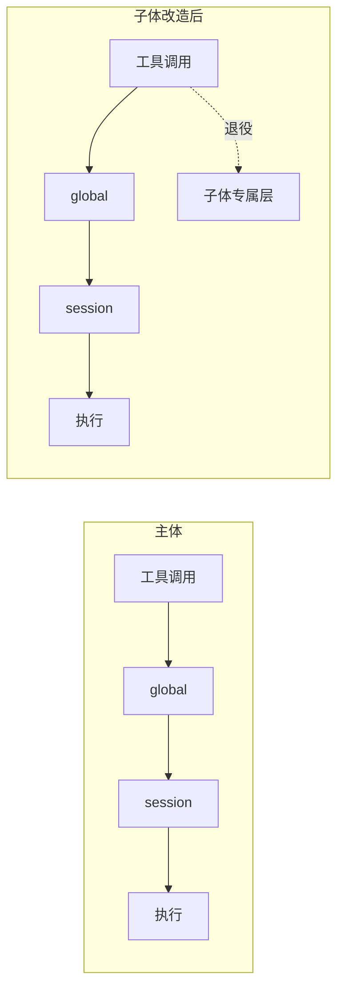
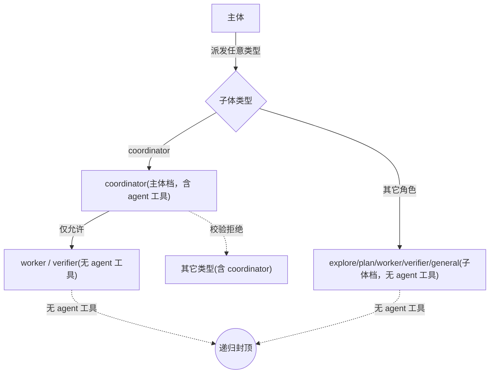
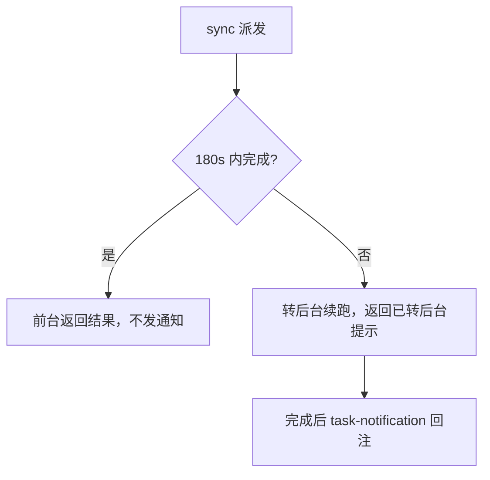
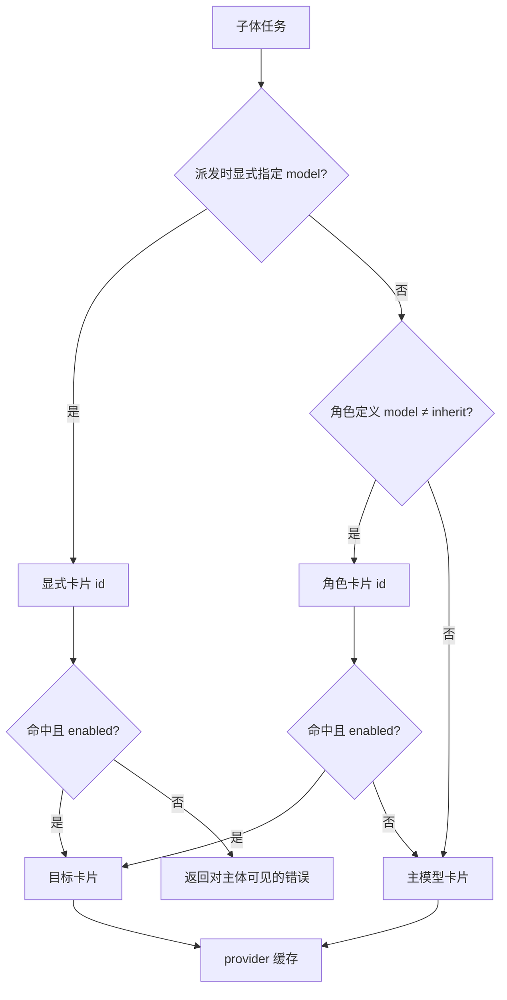

# 子体预算/授权移除与按角色模型分配方案

> 本版（v6）已按实际实现校准（截至 commit 0782625），关键取向见「修订说明」与「决策记录」。

## 修订说明

- 实现状态：以下各项均已落地，文档由"方案"校准为"已实现"。
- 执行超时：sync 派发新增**超时转后台**——前台等待硬编码 180s，超时不中断、转后台续跑，完成后经 task-notification 回注（详见 §3.4）。
- 模型解析：解析失败（显式 id 未命中/被禁用、主模型构建失败）时任务置 **FAILED** 并返回可见错误。
- 通知路由：修复生命周期投递通知时 `session_key` **双重 channel 前缀**（`origin_chat_id` 已含 `channel:` 前缀时直接复用）。
- 授权：子体改为**与主体一致应用工具策略**（同样经 global + session 两层），仅**退役子体专属第 3 层**；`GLOBAL_DENY_TOOLS`/`SESSION_TOOL_POLICY` 对子体与主体同等生效（不再"完全绕过"）。
- 防递归：退役第 3 层后，递归约束**仅剩 coordinator 校验**，由"加固项"升级为"**必须落实**"；coordinator 派发**收紧为仅 worker/verifier**。
- 预算：子体**不设软安全阀**，完全对齐主体（无上限）；并将主体同款循环防护与 token 预算**真正注入**子体执行链。
- 模型未命中：显式指定的无效 id 以**对主体可见的错误**返回；角色默认值可回退。
- provider 缓存：补充并发锁与热重载代际语义。
- 调用方身份：coordinator 收紧需把**父任务身份（caller agent_type / parent_task_id）的传递与解析**列为必须落点。
- 持久化兼容：删除 `TaskBudget` 后，子体任务表 `budget_json` 列**保留并忽略**（停止读写），历史任务正常加载。
- 模型失败收口：角色默认回退主模型后，**主模型也构建失败时**明确终止并返回可见错误。

---

## 一、背景与目标

主智能体已取消执行预算控制；工具策略引擎仍在生效路径上，默认空配置下放行，配置后即生效。子智能体目前保留独立预算与子体专属授权层，与主体不一致。本方案目标：

1. **子体预算彻底移除**，对齐主体「无上限」，并将主体同款循环防护与 token 预算**真正注入**子体执行链。
2. **子体执行工具与主体一致经过工具策略**（global + session 两层），仅退役子体专属第 3 层。
3. **按角色为子体分配不同模型**：内置子体烤进定义；动态派生由主体调用时决定；模型标识复用 `LLM_MODELS`。
4. **sync 派发超时转后台**：前台等待 180s 未完成则转后台续跑，不再中途取消。

---

## 二、现状要点

### 2.1 子体预算现状

预算链路：任务预算对象 → 工具入口透传步数/工具次数 → 执行器迭代上限（50）→ 执行循环翻译运行时上限 → 会话执行器逐轮校验，预算耗尽时强制汇总收尾。

### 2.2 工具策略现状与处置

策略引擎三层，主体经 global + session（`is_subagent=False` 永不触发第 3 层）；默认空配置下两层放行，配置后生效。

| 项 | 性质 | 处置 |
|---|---|---|
| 全局禁用表（global） | 系统级安全边界 | **保留**，对子体与主体同等生效 |
| 会话/渠道策略（session） | 渠道级安全边界 | **保留**，对子体与主体同等生效 |
| 子体专属层（禁用 agent 工具） | 子体专属限制 | **退役**（防递归改由装配档 + coordinator 校验保证） |
| `agent_def.tools` 白名单 / `disallowed_tools` | **角色能力定义**（explore 只读等） | **保留** |
| `permission_mode` 字段 | 已定义但未被消费 | 退役 |

> 「执行授权」指工具调用前经策略引擎的允许/拒绝判定（被拒时以错误结果回传给模型，不中断），非交互式审批（审批早已移除）。

### 2.3 子体模型现状

- 角色定义已有 `model` 字段、解析函数会读取，但**只返回模型名字符串，provider 仍固定为主体那一个**——目标模型在不同端点时会调用错误。
- `LLM_MODELS` 本就是多模型卡片列表（每卡含 id、模型名、端点、密钥、最大 token、温度、思考预算、能力标记）；模型注册表能全量解析；已有「按单卡构建 provider」的工厂。
- 但启动仅构建主模型一个 provider，全体共用。缺口：**卡片 id → provider 的解析与缓存**，以及**角色 → 模型**的来源。

---

## 三、设计一：移除子体预算，授权对齐主体

### 3.1 预算移除 + 控制同源注入

- 取消子体任务预算对象与相关入参；执行循环不再翻译运行时上限，统一「不限制」；执行器迭代上限由 50 改为不限制。
- **失控防护与主体真正同源**，且需补齐当前缺口：子体执行循环新建会话执行器时，目前**未传入循环防护与 token 预算**，移除预算后子体并不会自动获得主体那套配置。须打通注入链路：



- 两项须纳入热重载，配置更新时与主体同步刷新。
- 「预算耗尽汇总」对子体不再触发，成为无效路径。
- **不设软安全阀**：完全对齐主体，子体无步数/工具次数/墙钟上限，仅靠同源的循环防护与 token 压缩兜底。

### 3.2 执行授权：与主体一致应用策略

- 子体与主体**复用同一策略引擎**，执行工具时**同样经过 global + session 两层**判定；`GLOBAL_DENY_TOOLS`/`SESSION_TOOL_POLICY` 对子体与主体同等生效。
- **退役子体专属第 3 层**（原"禁用 agent 工具"判定）：策略不再因 `is_subagent` 差异化，主体/子体走相同判定路径。
- 拒绝处理沿用主体：被拒的工具调用以 `[工具调用被策略拒绝：原因]` 作为结果回传给（子）智能体，不中断。
- 防递归不再依赖策略层，改由装配档 + coordinator 校验保证（见 §3.3）。



### 3.3 防递归不变量（含 coordinator 收紧，必须落实）

退役第 3 层后，**防递归不再有策略层兜底，约束点仅剩两条，必须同时成立**：

1. 普通子体走「子体档」装配，**不注册 agent 工具**，无从派生。
2. coordinator 走「主体档」持有 agent 工具，**必须**补显式校验：**coordinator 仅可派发 worker / verifier**，派发其它类型（含 coordinator、explore/plan/general）一律拒绝。**此校验缺失将导致 coordinator 可派发任意类型乃至 coordinator 链。**

**前置（必须）：调用方身份要可靠传递。** 当前 agent 工具入口创建任务时只拿到目标 `subagent_type`，不携带"本次调用来自哪个父角色/父任务"，仅在执行器校验无法区分"主体派发 coordinator"（允许）与"coordinator 派发 coordinator"（拒绝）。故须：

- 子体（coordinator）装配的 agent 工具实例注入**调用方身份**（caller agent_type + caller task_id）；主体调用时身份为"主体"（无父任务）。
- spawn 时把 caller task_id 写入子任务 `parent_task_id`（字段与表列已存在，入口当前未传），校验规则：caller=coordinator → 目标仅限 {worker, verifier}；caller=主体 → 任意。



### 3.4 sync 执行超时转后台

子体 sync 派发是主体的一次工具调用，受主体侧工具超时约束（默认 60s）；长任务会被中途取消、结果丢失。改造为"超时转后台"：

- **前台等待上限硬编码 180s**（`_SYNC_TIMEOUT_S`）。
- sync 执行改为后台任务 + `asyncio.wait(timeout=180)`：180s 内完成 → 直接返回结果（前台，不发通知）；**超时不取消** → 标记 `run_in_background/async` 继续后台执行，立即返回"已转后台（task_id）"提示，完成后经 task-notification 回注。
- 配套（必须）：agent 工具设 **210s（180s+30s 缓冲）工具级超时**，避免主体默认 60s 工具超时在子体自行转后台前就把这次调用取消。
- 副作用：sync 任务现也登记进 `_running`，从而计入并发名额、可被取消（顺带修复此前"sync 绕过并发上限"）。



---

## 四、设计二：按角色分配子体模型

### 4.1 模型标识与配置来源

- 模型标识统一采用 `LLM_MODELS` 卡片 `id`，不引入新配置键。
- 每张卡片自带端点与密钥，「不同角色用不同端点」天然支持。

配置示例（卡片含全部必填字段；从模型可指向不同端点/密钥）：

```toml
[[LLM_MODELS]]
id = "main"
label = "主模型"
enabled = true
isPrimary = true
model = "..."
apiBase = "..."
apiKey = "..."
maxTokens = 8192
temperature = 0.7
[LLM_MODELS.capabilities]
toolCalling = true
streaming = true

[[LLM_MODELS]]
id = "fast"
label = "从模型"
enabled = true
isPrimary = false
model = "..."
apiBase = "..."     # 可不同端点
apiKey = "..."      # 可不同密钥
maxTokens = 4096
temperature = 0.3
[LLM_MODELS.capabilities]
toolCalling = true
streaming = true
```

### 4.2 解析优先级与未命中处理



- **显式指定未命中或被禁用 → 返回对主体可见的错误**（作为 agent 工具调用结果回传），便于主体据此调整（换 id 重试等），不静默回退。
- **角色默认值或缺省未命中 → 回退主模型**（允许静默），保证内置角色在精简配置下可运行。
- 解析失败（上述可见错误、主模型构建失败）时，子体任务置 **FAILED** 并将错误作为结果返回。

### 4.3 内置角色 vs 动态派生

- **内置角色**：模型烤进角色定义（`model` = 卡片 id）。默认仅一张主卡时全部回退主模型；新增从模型卡片后再把内置角色逐一指向目标卡片。机制先铺好，映射按需填入。
- **动态派生**：主体调用 agent 工具时通过新增的 `model` 参数指定卡片 id，由主体为本次子体决定模型。

### 4.4 provider 缓存与热重载语义

- 启动时按 `LLM_MODELS` 构建**完整模型注册表**（非仅主卡）。
- 维护「卡片 id → provider」**懒加载缓存**，**按卡片 id 粒度加锁**，避免后台并发子体首次命中同卡时重复构建。
- 热重载采用**代际语义**：重建注册表、切换缓存时，**已启动子体续用其已绑定 provider**，仅新任务用新代际，避免运行中交错。
- provider 构建失败（缺密钥/端点不可用）：显式指定 → 返回对主体可见的错误；角色默认 → 回退主模型并告警；**主模型本身构建失败 → 终止并返回可见错误（启动期直接失败、运行期 spawn 返回可见错误），不吞错、不返回空 provider。**

---

## 五、设计落点（模块级，非排期）

| 关注点 | 涉及模块 |
|---|---|
| 删除子体预算对象与透传 | 子体数据模型、agent 工具入口、执行器、执行循环 |
| 历史 `budget_json` 列保留并忽略（停止读写） | 子体存储层 |
| 子体迭代上限改无限制（不设软安全阀） | 运行内核、执行循环 |
| 循环防护 + token 预算注入子体（含热重载） | 运行内核、子体执行器、执行循环、会话执行器 |
| 退役策略第 3 层，子体与主体共用 global+session | 策略引擎、执行器/执行循环 |
| coordinator 仅派发 worker/verifier 校验（必须） | agent 工具入口或执行器 |
| 调用方身份传递与解析（caller agent_type + parent_task_id） | agent 工具入口、子体工具装配、执行器 |
| 完整模型注册表 + provider 缓存（锁/代际）+ 解析器 | 运行内核、模型注册表 |
| 任务携带模型标识、按任务解析模型 | 子体数据模型、执行器 |
| agent 工具新增 model 参数 | agent 工具入口 |
| 显式模型未命中返回可见错误 | agent 工具入口、执行器 |
| 内置角色烤入模型 | 角色定义；自定义角色经文件 frontmatter（已支持） |
| sync 超时转后台 + agent 工具 210s 超时缓冲 | 执行器、工具装配 |
| 模型解析失败将任务置 FAILED | 执行器 |
| 通知 session_key 去重 channel 前缀 | 子体生命周期 |

---

## 六、影响面与风险

- **安全边界**：子体与主体受**同样的** global/session 约束，全局禁用表对子体生效；不引入越权风险。
- **防递归收口**：退役第 3 层后递归约束仅剩装配档 + coordinator 校验，coordinator 校验**必须落实并测试**，否则失去唯一的递归约束点。
- **子体无上限运行**：不设软安全阀，依赖与主体同源的循环防护与 token 压缩兜底。
- **模型误用防护**：显式 id 错误不静默吞掉，以可见错误回主体，降低高成本模型误用与端点错配风险。
- **并发与热重载**：缓存锁与代际语义需在实现时验证（多后台子体并发首次命中、热重载与运行中子体并存）。
- **配置完整性**：从模型卡片须含端点/密钥等必填字段，缺失按失败策略处理。

---

## 七、兼容性

- 自定义角色文件 frontmatter 已支持 `model` 字段，加载方式不变。
- 角色定义保留 `max_turns` 字段以兼容历史定义，但不再用于预算控制。
- 配置层不新增键，沿用 `LLM_MODELS`，对既有配置无破坏。
- 子体任务表 `budget_json` 列保留但停止读写：新任务写默认值、读取不再反序列化为 `TaskBudget`，历史子体任务仍可正常加载与查询（不做删列迁移）。

---

## 八、决策记录

1. 子体**与主体一致应用工具策略**（global + session 同等生效），**退役子体专属第 3 层**；防递归改由装配档 + coordinator 校验保证 —— 已确认。
2. coordinator **仅可派发 worker / verifier**（退役第 3 层后为必须项）—— 已确认。
3. 子体**不设软安全阀**，完全对齐主体（无上限）—— 已确认。
4. 显式模型 id 未命中 → **返回对主体可见的错误**，便于主体调整；角色默认值可回退 —— 已确认。
5. sync 派发**超时 180s 转后台续跑**（不中断），agent 工具配 210s 工具级超时缓冲 —— 已实现。
6. 通知投递 `session_key` 修复**双重 channel 前缀**，确保后台结果回注到正确会话 —— 已实现。
